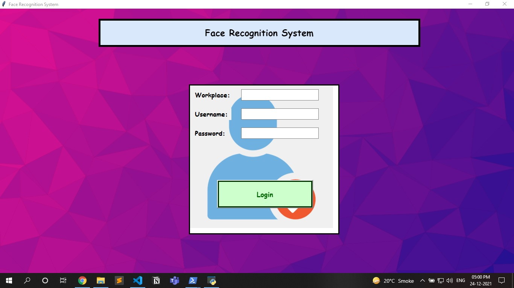
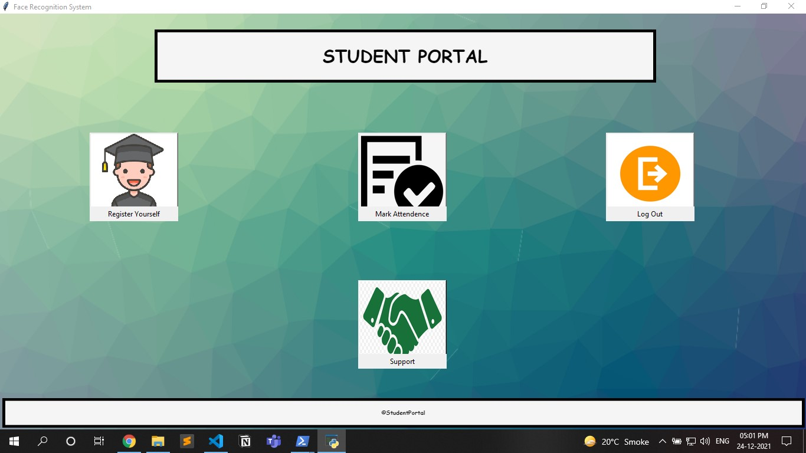
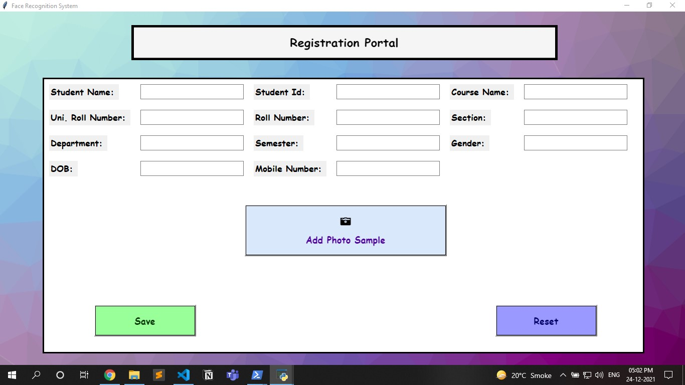
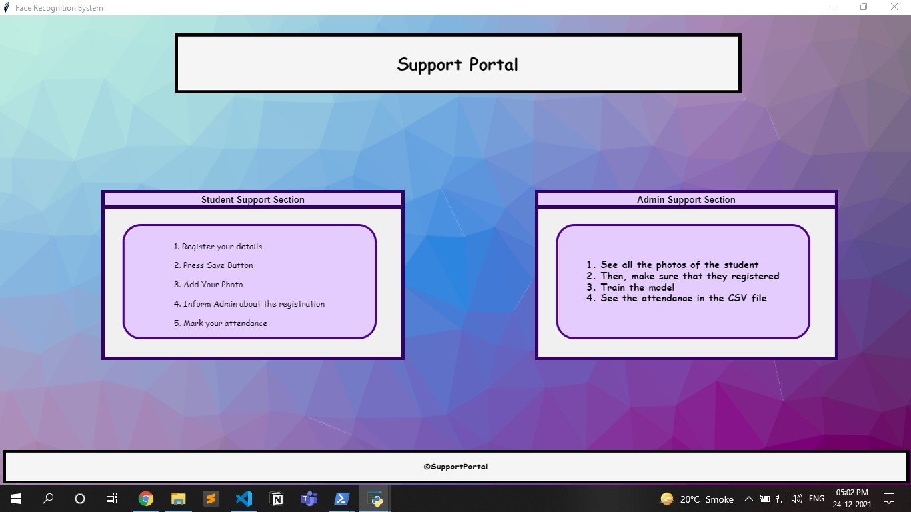
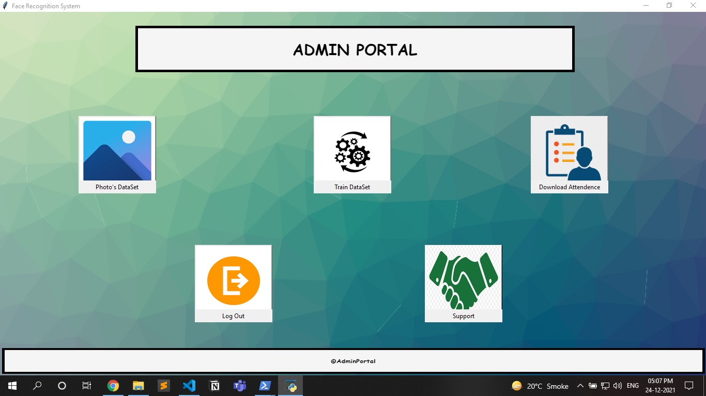
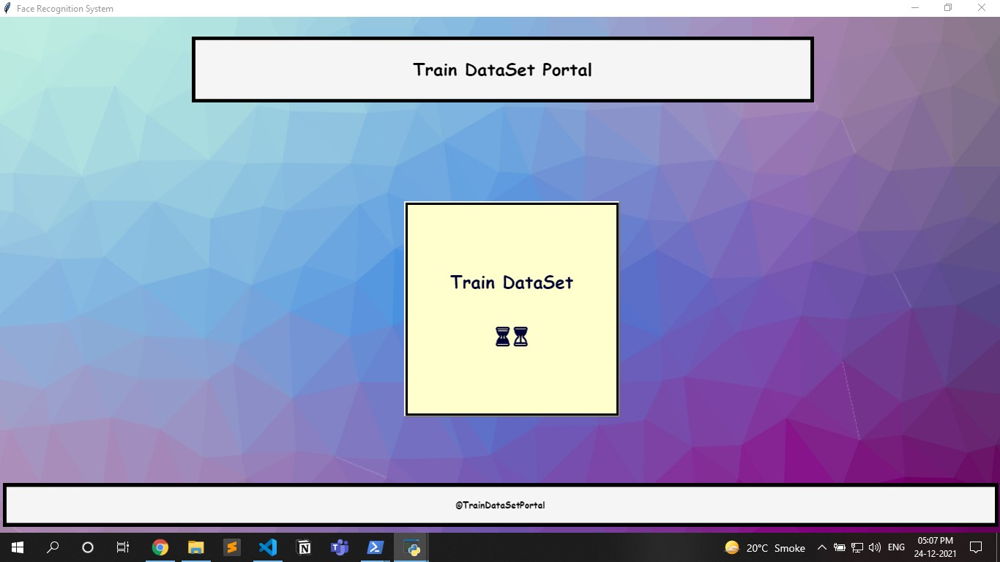
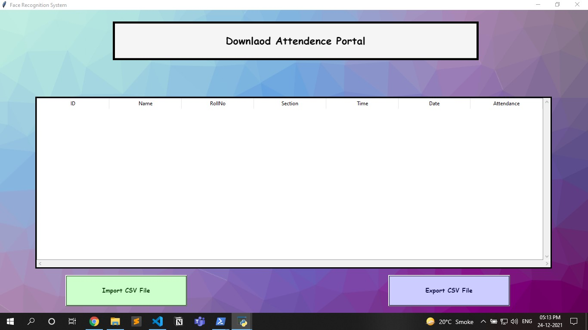

# Face Recognition Attendance System

<p><em><strong>Face recognition</strong></em> is a method of identifying or verifying a person's identity using their face. Face recognition systems can be used to identify people in photos, videos or in real-time.<br>
In this project, we verify or identify a person through real time so that a person can mark his presence efficiently.</p>

<p><strong><em>Note: Please follow the below mentioned procedures to make this project run efficiently.</em></strong></p>

<br>
<p>
   &nbsp;
   &nbsp;
   &nbsp;
   &nbsp;
</p>

<hr>

## Technology Used
1. Front End (UI part): Tkinter
1. Database: MySQL
1. OpenCV
1. Object Detection Algorithm: Haar Cascade
1. Face Recognition Algorithm: LBPH (Local Binary Pattern Histogram)

<hr>

## Dependencies ( Windows Oriented )
* Your system must have Python [Download Link](https://www.python.org/downloads/ "https://www.python.org/downloads/")

    * Check after installing:

        ```bash
        python --version

        pip --version
        ```

* Tkinter (Python already comes bundled with Tkinter)

    * But if you still face any error with Tkinter

        ```bash
        pip install tk
        ```

* Pillow 

    ```bash
    pip install Pillow
    ```

* Cv2

    ```bash
    pip install opencv-python
    ```

* numpy

    ```bash
    pip install numpy
    ```

* Install MySQL

> __Note:__ Install all the dependencies according to your system

<hr>

## Login Page
&nbsp;



&nbsp;
#### Key Points

1. __For Student Login:__
    * Workplace = student
    * username = user1
    * password = 1234
2. __For Admin Login:__
    * Workplace = admin
    * username = user2
    * password = 5678

&nbsp;


___
## Student Portal
&nbsp;



&nbsp;
#### Steps to Follow:
1. Click on _Register Yourself_
1. Inside _Register Yourself_ insert your details:
    * __Note:__
        1. Always start StudentId from 1 and then go 2,3,4...
        1. Date format: _YYYY-MM-DD_
1. After inserting details, save the details by pressing _save button_
1. Then, Add the __Photo Sample__ and exit that window
1. __Don't Mark Attendance until the model is trained__
1. As soon as, the model is trained you can mark your attendance
1. For any help go to support section
1. Then, Logout

&nbsp;
### Images Retaled to Student Portal:
&nbsp;


&nbsp;


&nbsp;



<hr>

## Admin Portal
&nbsp;



&nbsp;
#### Steps to Follow:
1. Check your _Data Set of Photos_ on Photo section
1. Train the _Data Set of Photos_
1. __Mark Attendance Before Downloading the Attendance__
1. Mark your attendance from _Student Portal_
1. Download / Watch attendance of the students from download Attendance section
1. For any help go to support section
1. Then, Logout

&nbsp;
### Images Retaled to Admin Portal:
&nbsp;


&nbsp;



<hr>

## Some MySQL (Database) Settings

* Install MySQL

* These settings need to be done:
    1. host = "localhost"
    1. username = "root"
    1. password = "1234"
    1. database = "face_recognition_system"

* After, Installing:
   
   1. Create a database named: face_recognition_system
   2. Inside that database create a table named: Student
   3. Inside that table form different columns given below:
  
      |Column Name|Data Type|Keys|
      |:-:|:-:|:-:|
      |StudentName|varchar(25)|
      |StudentId|varchar(10)|PRI|
      |CourseName|varchar(20)|
      |UniRollNo|varchar(15)|UNI|
      |RollNo|varchar(10)|
      |Section|varchar(10)|
      |Department|varchar(20)|
      |Semester|varchar(10)|
      |Gender|varchar(10)|
      |DOB|date|
      |MobileNo|varchar(10)|

<hr>

## Important Notes

* Start execution of the project from __login.py__ file
* Please Don't delete any file
* Please Install all the dependencies
* Delete __Dummy Image__ from __data folder__ before executing the project otherwise it will not give appropriate result
* Delete contents inside CSV file i.e __student_attendence.csv__ before executing the project otherwise it will not give appropriate result
* If any error occur _Please_ __Google it!__ 😂😂
